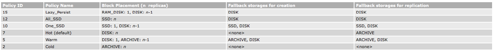
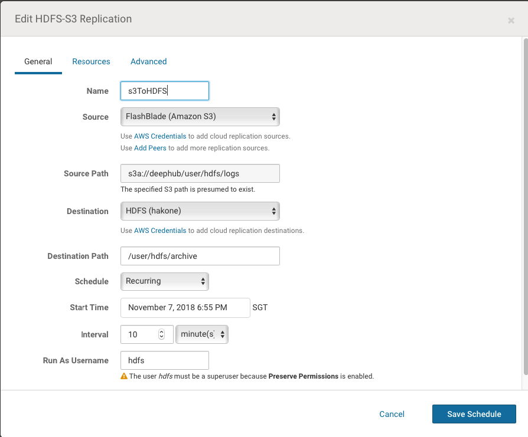

# Data Life Cycle Management
Manage data life cycle according to its "temperature". We define data temperature as HOT, WARM and COLD. For example, data created within 4 months is HOT, 4 to 13 months is WARM, longer than 13 months is COLD. A policy is created to automatically check data temperature, move or replicate data to its proper storage tier, e.g., HOT data sits in flash storage, WARN in local HDD, COLD in remote cheap storage.

## DLM Requirements
To implement data life cycle management (DLM), we need:
1. Being able to define storage type.
2. Being able to identify data temperature.
3. Tool to move/replicate data from one tier to another efficiently.
4. Data integrity check between source and target.
5. Scheduler to schedule to replication job.

We explain how to implement each of the above requirement.

### Define Storage Type
The first step of data life cycle management is to define heterogeneous storage type, so that the system is a collection of storages with each storage corresponding to a physical storage media. Typically, a DLM system requires storage type including DISK as default, SSD for fast I/O and ARCHIVE for archival storage.

In HDFS, on each data node, the comma-separated storage locations can be tagged with their storage types. This allows storage policies to place the blocks on different storage types according to policy.

For example:
`[DISK]/grid/0/hdfs/data,[DISK]/grid/1/data,[SSD]/flash/hdfs/data`

An experiment PROVIDED storage type is introduced to Hadoop 3.1. This allows HDFS to "mount" a remote storage (S3, Blob, etc.), access its data in a single name space and cache remote data locally. This enables several new use cases such as transparent backup data to object storage. Note PROVIDED storage is not ready for production use. See [HDFS Tiered Storage: Mounting Object Stores in HDFS](https://www.slideshare.net/Hadoop_Summit/hdfs-tiered-storage-mounting-object-stores-in-hdfs-77189018) for details.

### Identify Data Temperature
Currently, there is no automatic data temperature identify support in the Hadoop ecosystem. One needs to either do it manually or through third-party tool.

The below is an example of specify data temperature (attach a temperature policy) on a HDFS directory.
```sh
# Set /hbase storage policy to One_SSD
$ hdfs storagepolicies -setStoragePolicy -path /hbase -policy One_SSD
```

The following is a typical storage policy table.


See [Hadoop Archival Storage, SSD & Memory](https://hadoop.apache.org/docs/r3.1.0/hadoop-project-dist/hadoop-hdfs/ArchivalStorage.html) for details.

### Data Movement Between Storage Tiers
There are two approaches to move data between storage tiers, depending on system architecture.
1. Move data between storage types in a single HDFS system.
2. Replicate data between multiple storage systems.

We describe each of these approaches.

### Move Data Between Storage Types in HDFS
In recent Hadoop versions, the storage policy feature is enabled by default. The default storage type of a data node storage location will be DISK if it does not have a storage type tagged explicitly.

A typical DLM scenario in this approach looks like:
1. Create directories for different data temperature.
2. Attach storage policy to directories.
3. Put data into the directory, where storage policy is enforced automatically for new created data.
3. Change directory temperature periodically.
4. Move data blocks to fullfil the storage policy requirement.

The below is an example.
```sh
# Assume data is partitioned by date
$ hdfs dfs -mkdir /user/hdfs/mydata/2018-11-07

# Set storage policy to One_SSD.
$ hdfs storagepolicies -setStoragePolicy -path /user/hdfs/mydata/2018-11-07 -policy One_SSD

# Upload data to the directory.
# For data in this directory, HDFS automatically puts one replica in SSD, two in DISK.
$ hdfs dfs -put 2018-11-07.log /user/hdfs/mydata/2018-11-07

# For old data, change its policy to Hot.
# The policy name is misleading, but by changing it to Hot, all replicas are stored in DISK.
$ hdfs storagepolicies -setStoragePolicy -path /user/hdfs/mydata/2018-07-06 -policy Hot

# Run a Mover job to enforce the changed storage policy.
$ hdfs mover -p /user/hdfs/mydata/2018-07-06
Mover Successful: all blocks satisfy the specified storage policy. Exiting...
Nov 8, 2018 9:17:36 AM   Mover took 10sec

# For testing, check whether the storage policy is enforced.
# If ONE_SSD is set, output should be similar to the below. Notice at the end of the output, the block is placed on SSD.
$ hdfs fsck /user/hdfs/mydata/2018-11-07 -files -blocks -locations
/user/hdfs/hot/hot.txt 12 bytes, replicated: replication=3, 1 block(s):...
0. BP-139570110-10.226.228.6-1538100491457:blk_1073803027_62346 len=12 Live_repl=1  [DatanodeInfoWithStorage[10.226.228.6:9866,DS-5cf774f0-e49f-49b0-930b-bcd9b50f9f68,SSD]]
```

A new data migration tool is added for moving data. The tool is similar to Balancer. It periodically scans the files in HDFS to check if the block placement satisfies the storage policy. For the blocks violating the storage policy, it moves the replicas to a different storage type in order to fulfill the storage policy requirement.

Advantages:

* Single name space. Enforcing storage policy is transparent to applications.
* One system to manage.


Disadvantages:

* Only works for HDFS.
* Multiple types of storage medias in each node to manage. This can be addressed by using a shared storage for particular type. For example, by mounting a shared all-flash storage on each data node for SSD type.
* Not a backup up or disaster recovery solution.


[eBay Case Study: HDFS Storage Efficiency Using Tiered Storage](https://www.ebayinc.com/stories/blogs/tech/hdfs-storage-efficiency-using-tiered-storage/)


### Data Replication Between Storage Systems
Another approach is to use a remote storage system (e.g., cloud object storage) as a archival storage, and relays other mechanism manually or automatically to replicate data from local system to the remote. This is simple because the two systems are independent. It also enables use case like remote backup and disaster recovery. However, since the two systems are different name spaces, applications need to be aware of which system the data sit in. In other words, it is not transparent to applications.

Advantages:

* Works for HDFS, S3 and other compatible storage system.
* Scale each system independently.
* Can be used as simple remote backup and disaster recovery solution.


Disadvantages:

* Multiple name space. Applications need to be aware of which system the data sit in.
* Multiple systems to manage.
* Need to remove data from source after replication.


Hadoop DistCp is a command line tool to copy data from one Hadoop cluster to another in parallel. It also supports copying data between Hadoop cluster and HDFS compatible storage system such as S3.

Copy from HDFS to S3.
```sh
# Data source on HDFS
$ hdfs dfs -ls /user/hdfs/logs
-rw-r--r--   3 hdfs supergroup   13128321 2018-11-07 16:31 /user/hdfs/logs/hdfs-audit.log
-rw-r--r--   3 hdfs supergroup   10228916 2018-11-07 16:32 /user/hdfs/logs/hdfs-audit.log.2018-09-06

# Target on S3 (before distCp)
$ hdfs dfs -ls s3a://deephub/user/hdfs

# Run distCp job.
# The job runs in 2 mappers, copy from HDFS to S3.
$ hadoop distcp -m 2 -v -log /user/hdfs/distcplogs /user/hdfs/logs s3a://deephub/user/hdfs
18/11/07 17:06:02 INFO tools.DistCp: DistCp job-id: job_1541571195625_0004
18/11/07 17:06:02 INFO mapreduce.Job: Running job: job_1541571195625_0004
18/11/07 17:06:09 INFO mapreduce.Job: Job job_1541571195625_0004 running in uber mode : false
18/11/07 17:06:09 INFO mapreduce.Job:  map 0% reduce 0%
18/11/07 17:06:17 INFO mapreduce.Job:  map 100% reduce 0%
18/11/07 17:06:18 INFO mapreduce.Job: Job job_1541571195625_0004 completed successfully
...

# Job logs
$ hdfs dfs -ls /user/hdfs/distcplogs
Found 3 items
-rw-r--r--   3 hdfs supergroup          0 2018-11-07 17:06 /user/hdfs/distcplogs/_SUCCESS
-rw-r--r--   3 hdfs supergroup        187 2018-11-07 17:06 /user/hdfs/distcplogs/part-m-00000
-rw-r--r--   3 hdfs supergroup        165 2018-11-07 17:06 /user/hdfs/distcplogs/part-m-00001

$ hdfs dfs -cat /user/hdfs/distcplogs/part-m-00001
FILE_COPIED: source=hdfs://hadoop02.purestorage.int:8020/user/hdfs/logs/hdfs-audit.log, size=13128321 --> target=s3a://deephub/user/hdfs/logs/hdfs-audit.log, size=0

# Target on S3 (after distCp)
$ hdfs dfs -ls s3a://deephub/user/hdfs/logs
Found 2 items
-rw-rw-rw-   1 hdfs hdfs   13128321 2018-11-07 16:36 s3a://deephub/user/hdfs/logs/hdfs-audit.log
-rw-rw-rw-   1 hdfs hdfs   10228916 2018-11-07 16:36 s3a://deephub/user/hdfs/logs/hdfs-audit.log.2018-09-06

```

### Data Integrity Check
When copying from HDFS to HDFS, by default, distCp check data integrity by comparing CRC checksum of the source and target. Copying from HDFS to S3 or vice versa is different because they use different checksum approaches:

- HDFS: md5 of crc in each block, then md5 of those block md5s
- S3: MD5 of the object

However, this is not a concern because the distCp job internally uses the AWS SDK, which generates MD5 of the object, puts the MD5 value into request header before uploading it to S3. On the S3 server side, it compute the MD5 and compare it against the value included in request header to ensure data integrity.

### Replication Scheduler
A scheduler is introduced to schedule the replication job.



The above is a screenshot from the Cloudera Manager Replication Schedules UI. Here we create a policy to replicate data from S3 to HDFS every 10 minutes.

Under the hood, the scheduler executes a distCp job every 10 minutes to copy newly created/modified data from the source to the target. Replication result is similar to what described in section #3 Replicate Data Between Storage Tiers.

## Summary
Data life cycle management is an important topic in big data and hybrid cloud era. We described basic requirements and two approaches in the Hadoop ecosystem to implement DLM in this article: Data Movement Between Storage Tiers and Data Replication Between Storage Systems. Each has its advantages and disadvantages. User should choose the best one or mix the both to fullfil data life cycle management requirements.
